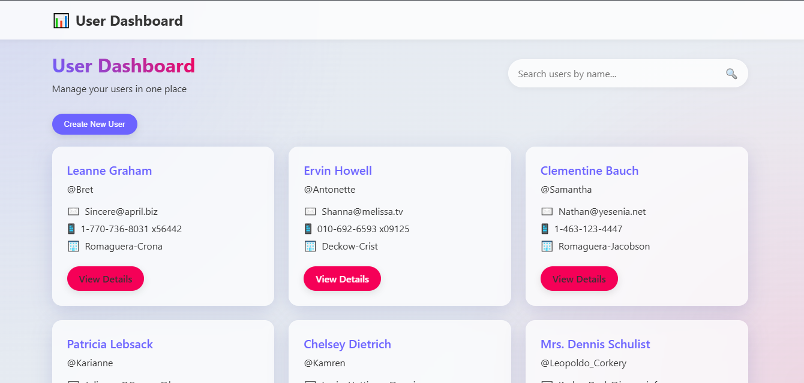

# User Dashboard - React Frontend Application



## 📋 Overview

A modern User Dashboard application built with React.js that displays user information from a REST API. The application features a sleek glass-morphism design with a responsive layout and intuitive user interface.

**Live Link:** [https://forty4-user-dashboard.vercel.app/](https://forty4-user-dashboard.vercel.app/)

## 🌟 Features

- **Dashboard Page:**
  - Displays a list of users in a modern card layout
  - Search functionality to filter users by name
  - "Create New User" form (client-side only)
  
- **User Details Page:**
  - View complete user information, including address and geo-location
  - Contact details and company information
  
- **Modern UI:**
  - Glass-morphism design with blur effects and transparency
  - Gradient backgrounds and sleek animations
  - Fully responsive layout that works on all device sizes
  
- **State Management:**
  - Uses React Context API for global state management
  - Efficient data fetching and state updates

## 🛠️ Tech Stack

- **React.js:** Functional components with hooks
- **React Router:** For handling client-side navigation
- **Fetch API:** For making HTTP requests to the JSON Placeholder API
- **React Context:** For global state management
- **CSS:** Modern styling with glass-morphism effects

## 📦 Installation & Setup

1. **Clone the repository:**
   ```bash
   git clone [repository-url]
   cd user_dashboard
   ```

2. **Install dependencies:**
   ```bash
   npm install
   ```

3. **Start the development server:**
   ```bash
   npm start
   ```

4. **Open your browser:**
   Navigate to [http://localhost:3000](http://localhost:3000)

## 📱 Application Structure

```
src/
├── components/
│   ├── Dashboard/
│   │   └── Dashboard.js
│   ├── UserDetails/
│   │   └── UserDetails.js
│   ├── NewUserForm/
│   │   └── NewUserForm.js
│   └── Navbar/
│       └── Navbar.js
├── context/
│   └── UserContext.js
├── App.js
├── App.css
├── index.js
└── index.css
```

## 🔍 API Integration

The application uses the [JSONPlaceholder API](https://jsonplaceholder.typicode.com/users) to fetch user data. The data structure includes:

- User personal information (name, username, email)
- Contact details (phone, website)
- Company information
- Address with geo-location

## 🎨 UI Design

The application features a modern design with:

- Glass-morphism effect for cards and UI elements
- Gradient backgrounds with subtle patterns
- Responsive layout that adapts to different screen sizes
- Clean typography and intuitive navigation

## 💻 Available Scripts

- `npm start` - Run the app in development mode
- `npm test` - Launch the test runner
- `npm run build` - Build the app for production

---

This project was created as part of the Forty4 Tech Frontend Assignment.
